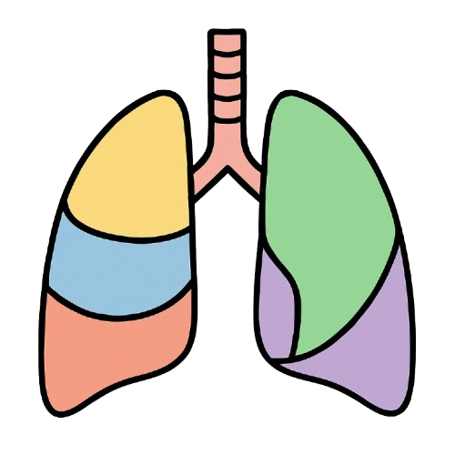

# LungSegmentation

<p align="center">
  
</p>

**LungSegmentation** is an extension for [3D Slicer](https://www.slicer.org/) allowing the **automatic segmentation of pulmonary structures** (parenchyma, airways, vascular tree) from medical images (DICOM or NRRD), using a pre-trained **nnU-Netv2** model.

---

## Features

* Segmentation of the **parenchyma**, **airways**, and **vessels**
* Support for **in-vivo** and **ex-vivo** data
* Direct loading of results into Slicer after prediction

---

## Installation

### From the Extension Manager (recommended)

1. Open **3D Slicer**
2. Go to the **Extension Manager**
3. Search for **LungSegmentation**
4. Click **Install**
5. Restart Slicer

### From Source Code

```bash
git clone [https://github.com/FlorianDAVAUX/LungSegmentation.git](https://github.com/FlorianDAVAUX/LungSegmentation.git)